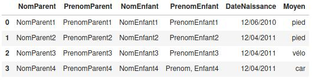
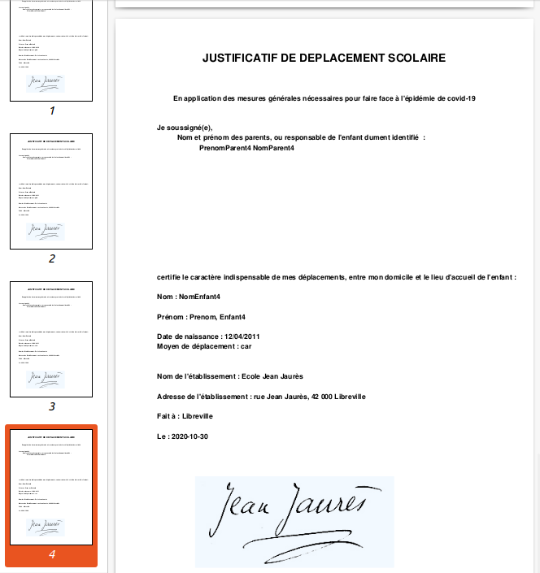

# Générateur de JUSTIFICATIF DE DÉPLACEMENT SCOLAIRE
> Ce projet vise à générer les JUSTIFICATIF DE DÉPLACEMENT SCOLAIRE par les établissements scolaires à partir de la liste des élèves.

Afin de faciliter la gestion des justificatifs ce projet propose un outil à destination des établissements scolaires et/ou des mairies pour générer en une fois toutes les attestations.

Il faut fournir à l'outil la liste des élèves :

Ainsi que le cachet de l'établissement :

Ensuite il génére un PDF contenant toutes les attestations, qu'il est donc facile d'imprimer en une fois :

Exemple en PDF : https://raw.githubusercontent.com/dataforgoodfr/covid_certificate_generator/master/test.pdf

Un site web pour faciliter son usage sera développé prochainement.

## Installation

`git clone git@github.com:dataforgoodfr/covid_certificate_generator.git`

Prochainement :

`pip install  covid_certificate_generator`

## Utilisation

- Scanner le cachet de l'établissement scolaire et appelez-le cachet.jpg
- Exportez la liste des élèves et appelez-là data.csv
- Exécutez le programme :
`python3 covid_certificate_generator/core.py`
