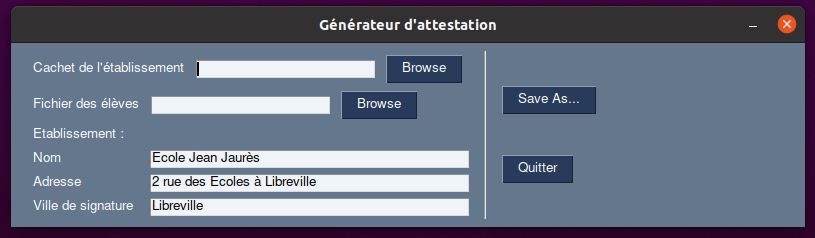
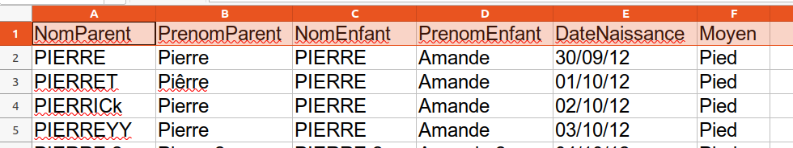

# Générateur du JUSTIFICATIF DE DÉPLACEMENT SCOLAIRE
> Ce projet vise à générer le JUSTIFICATIF DE DÉPLACEMENT SCOLAIRE par les établissements scolaires à partir de la liste des élèves.

Afin de faciliter la gestion des justificatifs, ce projet propose un outil à destination des établissements scolaires et/ou des mairies pour générer en une fois toutes les attestations.

Il faut fournir à l'outil la liste des élèves :

Ainsi que le cachet de l'établissement :

Ensuite, le logiciel génére un PDF contenant toutes les attestations, qu'il est donc facile d'imprimer en une fois :

Exemple en PDF : https://raw.githubusercontent.com/dataforgoodfr/covid_certificate_generator/master/test.pdf

Un site web pour faciliter son usage sera développé prochainement.

## Installation

### Windows
Télécharger l'application sur la page https://github.com/dataforgoodfr/covid_certificate_generator/releases

## Utilisation

Exécutez l'application : Une fenêtre noire va apparaître, c'est normal, l'application apparaîtra une dizaine de secondes plus tard :

Chargez le cachet de l'établissement scanné et le fichier des élèves dans un des formats suivants :
- CSV avec ";"
- CSV avec ","
- Excel 97-2003 (xls)
- Excel 2007-365 (xlsx)

Les colonnes doivent être nommées de cette façon :
- NomParent 	PrenomParent 	NomEnfant 	PrenomEnfant 	DateNaissance 	Moyen

